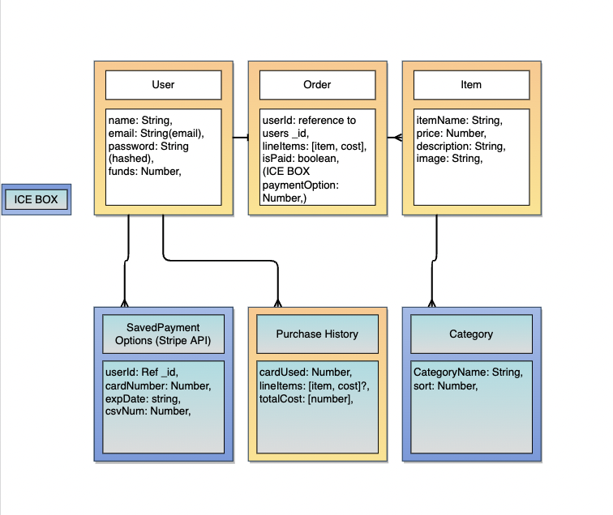

# LeetRigs 
Premium gear to make sure you destroy the competition!

# Premise:

Hey there! We started LeetRigs about a week ago, as life long avid gamers we have always had an undying passion for PC gaming. From RTS, to FPS and MMO's we have played them all and now decided to merge our love for gaming alongside creating custom PC builds together. All of our rigs are built in house with the latest top-notch hardware as well as put through extensive testing before ever being placed in our inventory. It's extremely important to us that you receive the highest quality service and we treat every PC as if it's our own. Launching our store has been an amazing experience so far and we cannot wait to make a hand-crafted custom rig for you, we also invite you to join our discord as we game with our customers regularly. Let's play!
---

## The User Story:
- As a user I want to be able to sign up for a new account
- As a user I want to be able to login to my existing account
- As a user I want to be able to logout of my current session 
- As a user I want to be able to view the "About Us" page and read the LeetRigs backstory
- As a user I want to be able to view all available inventory in the LeetRigs store (item, desc, price, img, etc.)
- As a user I want to be able to add an item to my cart from the itemcard OR itemdetail popup screen
- As a user I want to be able to view all contents of my cart prior to checkout
- As a user I want to be able to edit the qty of existing items in my cart using qty incrementer
- As a user I want to be able to remove items from my cart using qty incrementer
- As a user I want to be able to complete my order upon clicking checkout button
- As a user I want to be able to view my previous orders via the order history tab(invoice#, items, order date, total, etc)
- As a user I want to be able to utilize the search bar to query for the model name or keyword I am looking for

## Wireframes:

## ERD:

## Technologies Used:
- React
- Express
- Nodejs
- Trello
- MongoDB
- Mongoose
- Mongo Atlas
- Heroku

## MVP Requirments:
We are able Create a user Login, LogOut.
Using the API we are also able to add to cart, add more in quantity remove the item from cart.
We are able to see the Order history.
Once the item in cart, when clicked on checkout it will be added to the order history. 

## Stretch Goals / ICE BOX:
- User Profile Page where you can edit userName, emailm password and image. (Profile Picture is another ICE BOX Idea).
- You will be able to use filter buttons / the search bar to quickly sort the items by catagories.
- entering card data on checkout.
- savedPayment Schema / Model where you can save a credit card for use on checkout.

